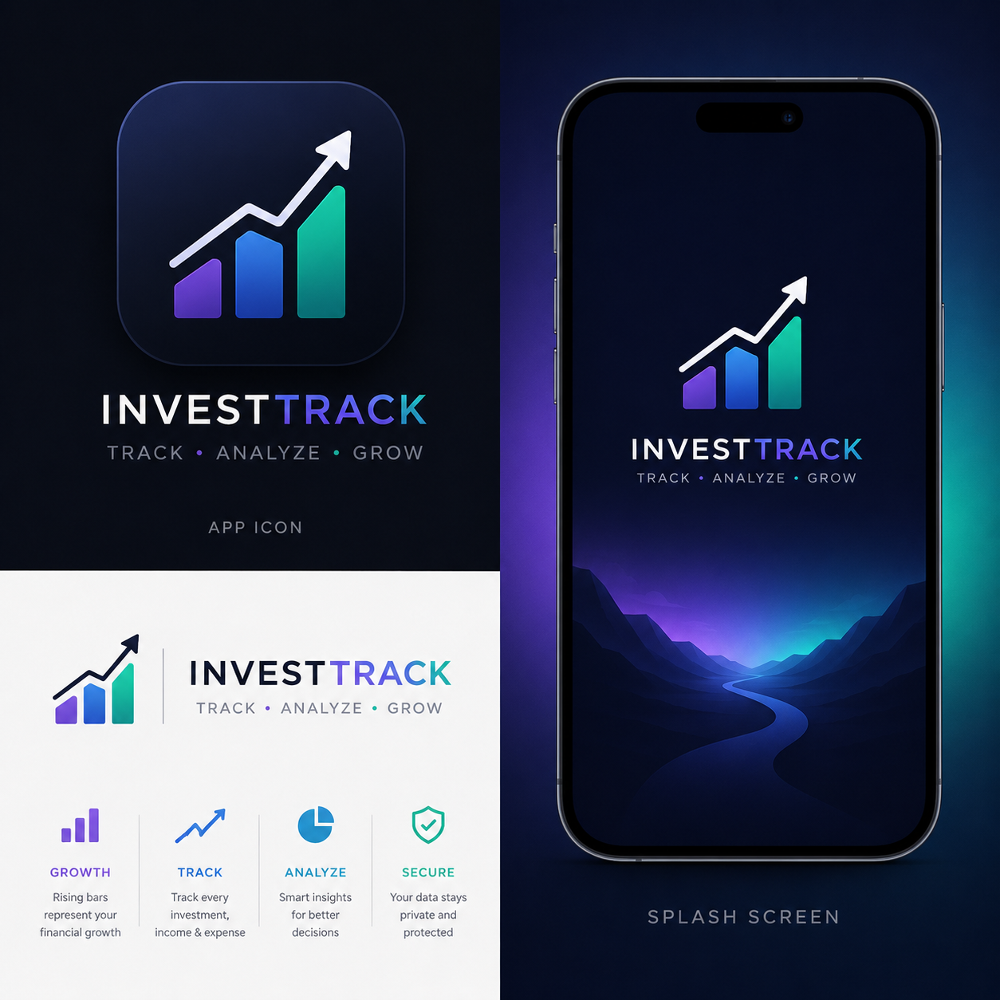

<p align="center">
  
</p>

<h1 align="center">InvestTrack</h1>

<p align="center">
  <strong>Production-Grade Offline-First Portfolio Analytics & Business Intelligence Engine</strong>
</p>

<p align="center">
  <a href="https://flutter.dev">
    
  </a>
  <a href="https://dart.dev">
    
  </a>
  <a href="https://riverpod.dev">
    
  </a>
  <a href="https://isar.dev">
    
  </a>
  <a href="#-architecture--core-principles">
    
  </a>
  <a href="LICENSE">
    
  </a>
</p>

<p align="center">
  InvestTrack is an offline-first, privacy-focused business intelligence and personal investment tracking application built with <strong>Flutter</strong>, <strong>Riverpod</strong>, and <strong>Isar Database</strong>. Designed for private equity investors, entrepreneurs, and portfolio managers, InvestTrack enables real-time tracking of capital allocations, operational revenue, expenses, dividends, asset sales, and cash flows across multiple businesses—processed 100% locally with zero cloud dependencies.
</p>

---

## 📋 Table of Contents

- [✨ Key Features](#-key-features)
- [🏗️ Architecture & Core Principles](#️-architecture--core-principles)
- [📐 Financial Engine & Calculation Formulas](#-financial-engine--calculation-formulas)
- [📁 Project Directory Structure](#-project-directory-structure)
- [🛠️ Tech Stack & Dependencies](#️-tech-stack--dependencies)
- [🚀 Getting Started](#-getting-started)
- [🧪 Testing & Quality Assurance](#-testing--quality-assurance)
- [📄 License & Author](#-license--author)

---

## ✨ Key Features

### 📊 Real-Time Portfolio Overview & Live Dashboard
- **Dynamic Portfolio Metrics**: Real-time aggregation of **Portfolio Value**, **Total Invested Capital**, **Net Profit**, **ROI %**, and **Net Cash Flow**.
- **Monthly Snapshot**: Instant visibility into the current calendar month's income, expenses, and net returns.
- **Business Performance Rankings**: Automatic leaderboard ranking businesses by net profit contribution.
- **Recent Activity Feed**: Chronological transaction stream with visual type indicators.

### 🏢 Multi-Business Portfolio Management
- **Entity Profiles**: Create and track multiple business investments with category, ownership equity %, location, owner details, and tags.
- **Active / Archived Lifecycle**: Archive inactive businesses without losing historical ledger records.
- **Isolated Metrics**: Dedicated financial metrics and history timelines for each individual business entity.

### 📑 Comprehensive 12-Event Transaction Ledger
- Standardized double-entry style event logging across 12 distinct categories:
  - 🟦 **Capital & Equity**: `Investment`, `Additional Investment`, `Withdrawal`
  - 🟩 **Earnings & Returns**: `Income`, `Dividend`, `Asset Sale`
  - 🟥 **Costs & Deductions**: `Expense`, `Tax`, `Asset Purchase`
  - 🟧 **Liabilities & Credit**: `Loan`, `Loan Repayment`
  - ⬜ **General**: `Other`
- **Filtering & Search**: Instant keyword search by notes, tags, category, amount, or business name with multi-option dropdown filters.
- **Receipt Attachments**: Store photo receipts and attachments locally.

### 📈 Interactive Visual Analytics & Charts
- Powered by `fl_chart` with smooth animations and light/dark theme support:
  - 📉 **Portfolio Value Growth** (Line Chart): Track portfolio trajectory over time.
  - 📊 **Monthly Profit Breakdown** (Bar Chart): Compare revenue vs expenses month-over-month.
  - 🥧 **Capital Allocation** (Pie Chart): Visualize equity distribution across business assets.
  - 🍩 **Transaction Type Distribution** (Pie Chart): Breakdown of ledger activity by event type.
  - 🌊 **Cash Flow Timeline** (Area Chart): Monitor net inflow and outflow trends.

### 💡 Automated Financial Insights
- **20+ Intelligent Insight Cards**: Automated statistical highlights including:
  - *Largest Investment*, *Largest Expense*, *Highest Income Month*, *Most Profitable Asset*, *Average ROI %*, *Total Taxes Paid*, *Total Withdrawals*, *Average Monthly Cash Flow*, and *Active Business Equity Distribution*.

### 📄 Offline Statement & Data Exports
- **PDF Financial Statements**: Professional document generator producing styled P&L summaries, business rankings, and transaction ledger tables.
- **CSV / Excel Exports**: Full structured data exports respecting active search queries and date filters.
- **Native Share Integration**: Export directly to local storage, email, or device apps via native OS share sheet.

### 🔔 Reminders & Notifications System
- **Local Due Date Alerts**: Schedule custom reminders for upcoming loan repayments, tax deadlines, or quarterly dividend reviews.
- **Offline Scheduling**: Zero server dependency—handled via native local notification dispatchers.

---

## 🏗️ Architecture & Core Principles

InvestTrack adheres to strict enterprise Flutter software architecture guidelines:

```
 ┌─────────────────────────────────────────────────────────────┐
 │                      UI Layer (M3)                          │
 │  Dashboard  │  Businesses  │  Ledger  │  Reports  │ Analytics  │
 └──────────────────────────────┬──────────────────────────────┘
                                │ Watches
                                ▼
 ┌─────────────────────────────────────────────────────────────┐
 │                 State Management (Riverpod)                 │
 │  dashboardProvider  │  reportsProvider  │ analyticsProvider │
 └──────────────────────────────┬──────────────────────────────┘
                                │ Delegates
                                ▼
 ┌─────────────────────────────────────────────────────────────┐
 │                     Financial Engine                        │
 │   FinancialEngine  │  TransactionCalculator Extension       │
 └──────────────────────────────┬──────────────────────────────┘
                                │ Queries Stream
                                ▼
 ┌─────────────────────────────────────────────────────────────┐
 │                   Repository Layer                          │
 │  IsarBusinessRepository  │  IsarTransactionRepository       │
 └──────────────────────────────┬──────────────────────────────┘
                                │ Local I/O
                                ▼
 ┌─────────────────────────────────────────────────────────────┐
 │               Local Storage (Isar Database)                 │
 └─────────────────────────────────────────────────────────────┘
```

1. **Single Source of Truth**: All financial calculations originate dynamically from the transaction ledger. No derived or calculated values are stored in the database.
2. **Separation of Concerns**: Presentation widgets contain zero business logic. Calculations reside strictly within the `FinancialEngine` and `TransactionCalculator` domain extensions.
3. **Reactive Pipeline**: Database changes in Isar emit streams through Repositories → Riverpod Providers → UI, updating dashboard cards and charts in the same render frame.
4. **Cascade Delete Guarantee**: Deleting a business atomically removes all associated transaction records within a single database transaction, preventing orphaned ledger items.

---

## 📐 Financial Engine & Calculation Formulas

The core accounting engine (`lib/features/transactions/utils/transaction_calculator.dart`) implements standardized financial logic:

| Metric | Formula / Logic | Description |
| :--- | :--- | :--- |
| **Total Invested** | $\sum (\text{Investment} + \text{Add. Investment})$ | Pure equity capital deployed into businesses. |
| **Net Profit** | $\sum (\text{Income} + \text{Dividend} + \text{Asset Sale}) - \sum (\text{Expense} + \text{Tax})$ | Net operating return generated by assets. |
| **ROI (%)** | $\left( \frac{\text{Net Profit}}{\text{Total Invested}} \right) \times 100$ | Return on invested equity capital. |
| **Net Cash Flow** | $\text{Inflows} - \text{Outflows}$ | Inflows: Income, Dividend, Asset Sale, Loan.<br>Outflows: Investment, Expense, Tax, Withdrawal, Asset Purchase, Loan Repayment. |
| **Portfolio Value** | $\text{Total Invested} + \text{Net Profit} - \text{Withdrawals} - \text{Asset Purchases}$ | Remaining active value of total portfolio holdings. |

---

## 📁 Project Directory Structure

```text
investtrack/
├── assets/
│   ├── branding/               # App icon & splash artwork
│   └── images/                 # Graphics & placeholder assets
├── lib/
│   ├── main.dart               # Application entry point & Riverpod Scope initialization
│   ├── core/
│   │   ├── constants/          # AppColors, AppSizes, AppTypography
│   │   ├── database/           # Isar database singleton & configuration
│   │   ├── financial/          # Financial Engine services & portfolio aggregators
│   │   ├── models/             # DateRangeFilter, global models
│   │   ├── router/             # GoRouter configuration & StatefulShellRoute navigation
│   │   ├── services/           # ExportService (PDF/CSV), NotificationService
│   │   ├── theme/              # Material 3 light/dark theme data & tokens
│   │   └── utils/              # Formatting helpers, date tools
│   ├── features/
│   │   ├── analytics/          # Interactive charts, insight cards, analytics provider
│   │   ├── businesses/         # Business profiles, CRUD, list screens, repository
│   │   ├── dashboard/          # Home screen, portfolio hero, summary cards, rankings
│   │   ├── documents/          # Receipt vault & document attachments
│   │   ├── notifications/      # Local notification handling & setup
│   │   ├── reminders/          # Scheduled transaction alerts & reminder sheets
│   │   ├── reports/            # P&L statements, monthly reports, export actions
│   │   ├── settings/           # Theme toggle, data management, export settings
│   │   └── transactions/       # Transaction ledger, 12 event types, calculator extension
│   └── shared/
│       └── widgets/            # Reusable UI components (AppCard, AppButton, AppLoader, etc.)
├── test/
│   ├── core/                   # Financial engine & unit tests
│   ├── features/               # Repository tests, calculator tests, widget tests
│   └── business_repository_test.dart
├── .github/
│   └── workflows/
│       └── ci.yml              # GitHub Actions CI (analyze & test)
├── pubspec.yaml                # Dependencies & Flutter asset definitions
├── LICENSE                     # MIT Open Source License
└── README.md                   # Project documentation
```

---

## 🛠️ Tech Stack & Dependencies

| Layer | Technology / Library | Purpose |
| :--- | :--- | :--- |
| **Framework** | [Flutter 3.x](https://flutter.dev) / [Dart 3.x](https://dart.dev) | Cross-platform UI toolkit |
| **State Management** | [flutter_riverpod](https://pub.dev/packages/flutter_riverpod) | Reactive, compile-safe state management |
| **Local Database** | [Isar Database](https://isar.dev) | Ultra-fast, local NoSQL storage engine |
| **Routing** | [go_router](https://pub.dev/packages/go_router) | Declarative route navigation & shell tabs |
| **Data Visualization**| [fl_chart](https://pub.dev/packages/fl_chart) | Animated line, bar, pie, and area charts |
| **PDF Generation** | [pdf](https://pub.dev/packages/pdf) & [printing](https://pub.dev/packages/printing) | Offline document layout & printing |
| **Data Export** | [csv](https://pub.dev/packages/csv) & [share_plus](https://pub.dev/packages/share_plus) | CSV creation & OS share sheet integration |
| **Styling & Icons** | Material Design 3 / [google_fonts](https://pub.dev/packages/google_fonts) | Modern typography & dynamic dark theme |

---

## 🚀 Getting Started

### Prerequisites

Ensure you have the following installed on your machine:
- [Flutter SDK](https://docs.flutter.dev/get-started/install) (`>= 3.12.0`)
- [Dart SDK](https://dart.dev/get-started) (`>= 3.12.0`)
- Android Studio / Xcode (for mobile emulators) or Windows/Mac desktop tools

### Installation Steps

1. **Clone the repository**:
   ```bash
   git clone https://github.com/SAfiyanRafi/InvestTrack.git
   cd InvestTrack
   ```

2. **Install Flutter packages**:
   ```bash
   flutter pub get
   ```

3. **Generate code artifacts** (Isar schemas & Riverpod providers):
   ```bash
   flutter pub run build_runner build --delete-conflicting-outputs
   ```

4. **Run the application**:
   ```bash
   # Run on connected device or emulator
   flutter run
   ```

---

## 🧪 Testing & Quality Assurance

InvestTrack includes a test suite covering the financial engine, calculation edge cases, repository cascade deletes, and UI widgets.

Run static analysis:
```bash
flutter analyze
```

Run test suite:
```bash
flutter test
```

---

## 📄 License & Author

Developed with ❤️ by **[Safiyan Rafi](https://github.com/SAfiyanRafi)**.

Distributed under the **MIT License**. See [`LICENSE`](LICENSE) for complete details.